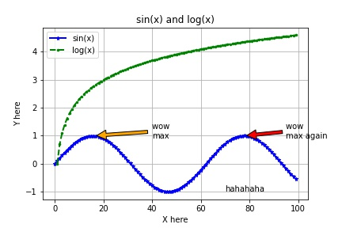
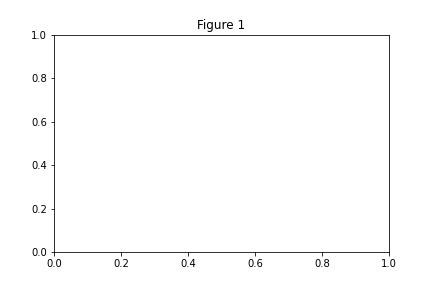
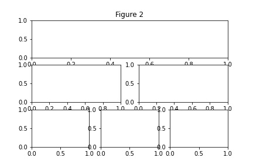
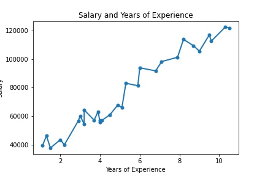
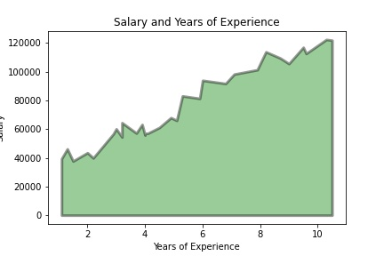
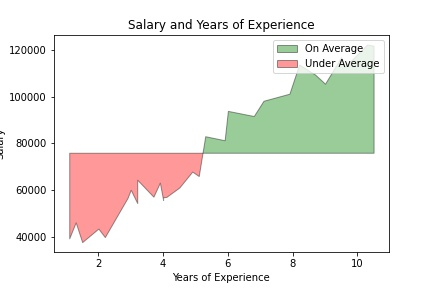

In this Python Universe, I want to learn and show you all the Python skills.

All skills are base on the implementation of Python 3.

# Table of contents

<!-- \[(.*)\]\((.*)\) -->
<!-- <li><a href="$2">$1</li> -->

<table>
<tr><th>Must Know</th><th>Classes</th><th>Functions</th></tr>
<tr>
<td>
<ul style="margin: 8px">
<li><a href="#list--dict--set-comprehensions">List & Dict & Set Comprehensions</li>
<li><a href="#lambda-functions">Lambda Functions</li>
<li><a href="#map">Map</li>
<li><a href="#filter">Filter</li>
<li><a href="#zip">Zip</li>
<li><a href="#reduce">Reduce</li>
<li><a href="#args--kwargs">*args & **kwargs</li>
<li><a href="#unpack-variables">Unpack variables</li>
<li><a href="#generator-map-filter-zip">Generator (map, filter, zip)</li>
<li><a href="#closure--decorator">Closure & Decorator</li>
<li><a href="#context-manager">Context Manager</li>
<li><a href="#magic-method">Magic Method</li>
<li><a href="#metaclasses">Metaclasses</li>
<li><a href="#threading--multiprocessing">Threading & Multiprocessing</li>
</ul>
</td>

<td>
<ul style="margin: 8px">
<li><a href="#self-class-instance">self (class instance)</li>
<li><a href="#variables-class--instance">variables (class & instance)</li>
<li><a href="#method-vs-classmethod-vs-staticmethod">method vs. classmethod vs. staticmethod</li>
<li><a href="#\_-private-vs-\_\_-name-mangling">_ (private) vs. __ (name mangling)</li>
<li><a href="#property-getter-setter">@property (getter, setter)</li>
<li><a href="#legb-local-enclosing-global-builtins">LEGB (local, enclosing, global, builtins)</li>
<li><a href="#abstract-class">Abstract class</li>
<li><a href="#dataclasses">Dataclasses</li>
<li><a href="#classes-in-dynamic-language">Classes in Dynamic Language</li>
</ul>
</td>

<td>
<ul style="margin: 8px">
<li><a href="#enclosing-function">Enclosing function</li>
<li><a href="#attrs">Attrs</li>
<li><a href="#functions-in-dynamic-language">Functions in Dynamic Language</li>
</ul>
</td>

</tr>
</table>

<table>
<tr><th>Collections</th><th>Itertools</th><th>Functools</th></tr>

<tr>
<td rowspan="3">
<ul style="margin: 8px">
<li><a href="#defaultdict">defaultdict</li>
<li><a href="#ordereddict">OrderedDict</li>
<li><a href="#counter">Counter</li>
<li><a href="#namedtuple">namedtuple</li>
<li><a href="#deque">deque</li>
</ul>
</td>

<td rowspan="1">
<ul style="margin: 8px">
<li><a href="#count">count</li>
<li><a href="#cycle">cycle</li>
<li><a href="#repeat">repeat</li>
</ul>
</td>

<td rowspan="3">
<ul style="margin: 8px">
<li><a href="#reduce">reduce</li>
</ul>
</td>

</tr>
<tr>
<td rowspan="1">
<ul style="margin: 8px">
<li><a href="#accumulate">accumulate</li>
<li><a href="#chain">chain</li>
<li><a href="#compress">compress</li>
<li><a href="#filterfalse">filterfalse</li>
<li><a href="#groupby">groupby</li>
<li><a href="#islice">islice</li>
<li><a href="#starmap">starmap</li>
<li><a href="#takewhile">takewhile</li>
<li><a href="#dropwhile">dropwhile</li>
<li><a href="#zip_longest">zip_longest</li>
</ul>
</td>
</tr>

<tr>
<td rowspan="1">
<ul style="margin: 8px">
<li><a href="#product">product</li>
<li><a href="#permutations">permutations</li>
<li><a href="#combinations">combinations</li>
<li><a href="#combinations_with_replacement">combinations_with_replacement</li>
</ul>
</td>
</tr>

</tr>
</table>

<table>
<tr><th>String</th><th>Int</th><th>Set</th><th>Tuple</th></tr>
<tr>
<td><ul style="margin: 8px"><li><a href="#f-string">f-string</li></ul></td>
<td><ul style="margin: 8px"><li><a href="#underscore-placeholders">Underscore Placeholders</li></ul></td>
<td><ul style="margin: 8px"><li><a href="#search">Search</li></ul></td>
<td><ul style="margin: 8px"><li><a href="#swap">Swap</li></ul></td>
</tr>

</table>

<table>
<tr><th>Conditional</th><th>For-Loop</th><th>Try-Except</th><th>Design</th><th>Ipython</th></tr>

<td><ul style="margin: 8px"><li><a href="#ternary-operator">Ternary operator</li></ul></td>

<td><ul style="margin: 8px">
<li><a href="#enumerate">Enumerate</li>
<li><a href="#for-else">For-Else</li>
</ul></td>

<td><ul style="margin: 8px"> <li><a href="#teef">TEEF</li></ul></td>

<td><ul style="margin: 8px">
<li><a href="#annotation">Annotation</li>
<li><a href="#typing">Typing</li>
<li><a href="#pass-and-ellipsis">Pass and Ellipsis</li>
</ul></td>

<td><ul style="margin: 8px">
<li><a href="#vscode-python-interactive-window">VSCode Python Interactive window</li>
<li><a href="#time-measure">Time Measure</li>
<li><a href="#memory-measure">Memory Measure</li>
</ul></td>
</table>

<table>
<tr><th>Module</th></tr>
<td><ul style="margin: 8px">
<li><a href="#pathlib">pathlib</li>
</ul>
</td>
</table>

<table>
<tr><th>Numpy</th><th>Pandas</th><th>Matplotlib (Pyplot)</th></tr>
<td><ul style="margin: 8px">
<li><a href="#create-array-or-matrix">Create Array or Matrix</li>
<li><a href="#basic-operations">Basic Operations</li>
<li><a href="#indexing-and-slicing">Indexing and Slicing</li>
<li><a href="#shape-manipulation">Shape Manipulation</li>
<li><a href="#copying">Copying</li>
<li><a href="#broadcasting">Broadcasting</li>
</ul></td>

<td><ul style="margin: 8px">
<li><a href="#creation-and-viewing">Creation and Viewing</li>
<li><a href="#selection">Selection</li>
<li><a href="#setting-deleting-and-handling">Setting, Deleting, and Handling</li>
<li><a href="#operations-and-apply-functions">Operations and Apply Functions</li>
<li><a href="#concat-and-merge">Concat and Merge</li>
<li><a href="#grouping-and-categorical-data-type">Grouping and Categorical Data Type</li>
<li><a href="#other-pandas-tricks">Other Pandas Tricks</li>
</ul></td>

<td><ul style="margin: 8px">
<li><a href="#basic-single-plot">Basic (Single Plot)</li>
<li><a href="#multiple-figures-and-axes">Multiple Figures and Axes</li>
<li><a href="#line-plots-and-filling-area">Line Plots and Filling Area</li>
</ul></td>
</table>

# Must Know

## List & Dict & Set Comprehensions

``` py
[(i, j) for i in range(3) for j in range(3) if i > j]

# [(1, 0), (2, 0), (2, 1)]
```

- [Details 🔥](must_know/list_dict_set_comprehensions.md)

## Lambda Functions

``` py
li = [1, 2, 3]
li = [*map(lambda x: x * 10, li)]

#li = [10, 20, 30]
```

- [Details 🔥](must_know/lambda_functions.md)

## Map

``` py
num1 = [100, 1, 20]
num2 = [19, 4, 94]
num3 = [40, 6, 30]

[*map(lambda x, y, z: max(x, y, z), num1, num2, num3)]
# [100, 6, 94]
```

- [Details 🔥](must_know/map.md)

## Filter

``` py
names = ['Liam', 'Olivia', 'Noah', 'Emma', 'Oliver', 'Ava']
choice = filter(lambda x: x.startswith('O'), names)

print(*choice, sep=', ') # Olivia, Oliver
```

- [Details 🔥](must_know/filter.md)

## Zip

``` py
a = [1, 2, 3]
b = [4, 5, 6]

c = [*zip(a, b)]  # [(1, 4), (2, 5), (3, 6)]
a, b = zip(*c)    # a=(1, 2, 3),  b=(4, 5, 6)
```

- [Details 🔥](must_know/zip.md)

## *args & **kwargs

### Defining Functions with *arg and **kwarg

``` py
def example(a, *arg, b=0, **kwarg):
    print(a)     # 1
    print(arg)   # (2, 3)
    print(b)     # 1
    print(kwarg) # {'x': 'a', 'y': [1, 2, 3]}

example(1, 2, 3, b=1, x='a', y=[1, 2, 3])
```

### Calling Functions with *arg and **kwarg

``` py
def func(greet, time, name):
    print(greet, time, name)

func(*["Good", "Morning"], **{"name": "Jay"})
# Good Morning Jay
```

- [Details 🔥](must_know/arg_kwarg.md)

## Unpack Variables

### Unpacking Iterable

``` py
a, b, *_ = [1, 2, 3, 4, 5]
# 1, 2, [3, 4, 5]
```

### Unpacking Generator

``` py
first, *amid, last = map(lambda x: x**2, range(1, 10000))
first  # 1
last   # 99980001
```

### Unpacking in For-loop

``` py
sales = [("Pencil", 0.22, 1500), ("Notebook", 1.30, 550)]

for product, *_ in sales:
    print(product)
    # Pencil, Notebook
```

### Unpacking Function

``` py
def compute(i):
    return i, i ** 2, i ** 3, i ** 4, i ** 5

num, power, cube, *_ = compute(3)
power  # 9
cube   # 27
```

### Combining Dicts

``` py
number = {"one": 1, "two": 2}
letter = {"a": "A", "b": "B"}

combine = {**number, **letter}
combine  # {'one': 1, 'two': 2, 'a': 'A', 'b': 'B'}
```

- [Details 🔥](must_know/unpack_variables.md)

## Generator (map, filter, zip)

``` py
def square_it(value):
    for i in range(value):
        yield i**2

li = square_it(10_000_000)

[i for i in li if i < 50]  # [0, 1, 4, 9, 16, 25, 36, 49]
```

- [Details 🔥](must_know/generator.md)

## Closure & Decorator

``` py
def count_decorator(count):  # new decorator with argument
    def decorator(orig_func):
        def wrapper(*args, **kwargs):
            print(f"func name: {orig_func.__name__}")
            print(f"func args: {args}, {kwargs}")

            for _ in range(count):  # use the argument
                orig_func(*args, **kwargs)

        return wrapper
    return decorator  # return the original decorator

@count_decorator(2)
def greet(msg):
    print(msg)


greet("hello")
# func name: greet
# func args: ('hello',), {}
# hello
# hello
```

- [Details 🔥](must_know/closure_decorator.md)

## Context Manager

``` py
@contextmanager
def enterFolder(folderName):
    home = os.getcwd()
    os.chdir(folderName)
    yield
    os.chdir(home)

with enterFolder('folder1'), open('example1.txt', 'w') as f:
    f.write('file1')
```

- [Details 🔥](must_know/context_manager.md)

## Magic Method

``` py
class BinaryInt(str):
    def __new__(cls, val):
        return str.__new__(cls, f"{val: b}")

    def __add__(self, val):
        val += int(self, 2)
        return f"{val:b}"


a = BinaryInt(2)
print(a)      # 10
print(a + 4)  # 110
```

- [Details 🔥](must_know/magic_method.md)

## Metaclasses

``` py
class Meta(type):
    def __new__(mtcls, name, bases, attrs):
        if name != "Base" and "must_to_do" not in attrs:
            raise TypeError("Bad Class: must_to_do() is needed")
        return super().__new__(mtcls, name, bases, attrs)


class Base(metaclass=Meta):
    def server_func(self):
        return self.must_to_do()


class Derived(Base):
    ...
# TypeError: Bad Class: must_to_do() is needed
```

- [Details 🔥](must_know/metaclasses.md)

## Threading & Multiprocessing

``` py
import concurrent.futures

with concurrent.futures.ThreadPoolExecutor(max_workers=5) as executor:
    futures = [executor.submit(load_url, url, 60) for url in URLS]
    for future in concurrent.futures.as_completed(futures):
        result = future.result()
        print(len(result))


with concurrent.futures.ProcessPoolExecutor() as executor:
    results = executor.map(load_url, URLS, [60] * len(URLS), chunksize=4)
    for result in results:
        print(len(result))
```

- [Details 🔥](must_know/threading_multiprocessing.md)

# Classes

## self (class instance)

``` py
class Person:
    def __init__(self, name):
        self.name = name

    def say(self):
        return f"I'm {self.name}"


p = Person("Jay")
p.say() == Person.say(p)  # True
```

- [Details 🔥](classes/self_class_instance.md)                  

## variables (class & instance)

``` py
class Employee:
    num_emp = 0  # Class variable

    def __init__(self, pay):
        self.pay = pay  # Instance variable
        Employee.num_emp += 1

e1 = Employee(100)
e2 = Employee(200)

e1.num_emp        # 2
Employee.num_emp  # 2

e1.pay  # 100
Employee.pay  # AttributeError: type object 'Employee' has no attribute 'pay'
```

- [Details 🔥](classes/variables_class_instance.md)       

## method vs. classmethod vs. staticmethod

``` py
class Person:
    def __init__(self, name, age):
        self.name = name
        self.age = age

    @staticmethod
    def splitPersonString(string, split_sign="-"):
        return string.split(split_sign)

    @classmethod
    def fromString(cls, cls_str):
        return cls(*cls.splitPersonString(cls_str, ", "))


p1 = Person.fromString("Jay, 99")
p1.name  # Jay
p1.age   # 99
```

- [Details 🔥](classes/method_class_static.md) 

## _ (private) vs. __ (name mangling)

``` py
class Dog:
    _weight = 5  # private variable

    def __bark(self):  # name mangling fucntion
        print("bark")


dog = Dog()
dog._weight       # 5
dog.__bark()      # AttributeError: 'Dog' object has no attribute '__bark'
dog._Dog__bark()  # bark
```

- [Details 🔥](classes/private_name_mangling.md)    

## @property (getter, setter)   

``` py
class User:
    def __init__(self, first_name, last_name, password):
        self.first_name = first_name
        self.last_name = last_name
        self.password = password

    @property
    def fullname(self):
        return f"{self.first_name} {self.last_name}"

    @property
    def password(self):
        raise AttributeError("password is not readable.")

    @password.setter
    def password(self, passord):
        from hashlib import md5

        self.password_hash = md5(b"{password}").hexdigest()


user = User("Mimi", "Wang", "0000")
user.fullname       # Mimi Wang
user.password_hash  # 7fbccc9c3a9a5afef65563cd00404c1416
user.password       # Attribute Error: password is not readable.
```

- [Details 🔥](classes/property_getter_setter.md)

## LEGB (local, enclosing, global, builtins)

``` py
min([1, 2, 31])  # builtins min
min = "global min"

def outer():
    # we can do "global min" here to change global
    min = "enclosing min"
    
    def inner():
        # we can do "nonlocal min" here to change enclosing
        min = "local min"
```

- [Details 🔥](classes/legb.md)       

## Abstract class

``` py
from abc import ABC, abstractmethod


class Base(ABC, object):
    @property
    @abstractmethod
    def foo(self):
        ...

    @abstractmethod
    def do(self):
        ...
```

- [Details 🔥](classes/abstract_class.md)                               

## Dataclasses                                    

``` py
from dataclasses import InitVar, dataclass, field
from typing import List


@dataclass
class InventoryItem:
    name: str
    unit_price: float = field(default=0.0)
    quantity_on_hand: int = field(default=0, repr=False)
    parts: List[str] = field(default_factory=list)
    parts_number: InitVar[int] = 0

    def __post_init__(self, parts_number):
        self.parts.extend([f"part{i}" for i in range(1, parts_number + 1)])


item = InventoryItem("product", parts_number=2)
# InventoryItem (name = 'product', unit_price=0.0, parts=['part1', 'part2'])
```

- [Details 🔥](classes/dataclasses.md) 

## Classes in Dynamic Language

``` py
def getClass(x):
    if x == 1:
        for i in range(11):

            class Example:
                a = i

        return Example


cls = getClass(1)
cls.b = "123"
print(cls.a, cls.b)  # 10 123
```

- [Details 🔥](classes/dynamic_language.md)                           

# Functions

## Enclosing function

``` py
def add_with_b(b):
    def add(a):
        return a + b
    return add

add4 = add_with_b(4)
add4(3)  # 7
add4(7)  # 11
```

- [Details 🔥](functions/enclosing.md)  

## Attrs

``` py
class Cat:
    def __repr__(self):
        return f"({self.name}: {self.age})"

listOfCats = []
attrs = [{"name": "meow1", "age": 5}, {"name": "meow2", "age": 10}]

for attr in attrs:
    cat = Cat()
    for key, val in attr.items():
        setattr(cat, key, val)
    listOfCats.append(cat)


print(listOfCats)
# [(meow1: 5), (meow2: 10)]
```

- [Details 🔥](functions/attrs.md)                       

## Functions in Dynamic Language

``` py
for i in range(100):
    def say():
        print(i)


def returnFunc(a):
    if a < 100:
        def mul(b):
            print(a * b)
        return mul
    else:
        def add(b):
            print(a + b)
        return add
```

- [Details 🔥](functions/dynamic_language.md) 

# Collections

## defaultdict

``` py
from collections import defaultdict

d = defaultdict(list)
d["a"] = [1, 2, 3]
d["b"].append(4)
d["c"].extend([5, 6])

# defaultdict(<class 'list'>, {'a': [1, 2, 3], 'b': [4], 'c': [5, 6]})
```

- [Details 🔥](collections/defaultdict.md) 

## OrderedDict

``` py
from collections import OrderedDict

location = ["C", "B", "A"]
population = [32, 46, 12]

d = OrderedDict({l: p for l, p in zip(location, population)})
# OrderedDict([('C', 32), ('B', 46), ('A', 12)])

d["D"] = 44
# OrderedDict([('C', 32), ('B', 46), ('A', 12), ('D', 44)])

d.popitem(last=False)
# OrderedDict([('B', 46), ('A', 12), ('D', 44)])

d.move_to_end("D", last=False)
# OrderedDict ([( 'D', 44), ('B', 46), ('A', 12)])
```

- [Details 🔥](collections/ordereddict.md) 

## Counter

``` py
from collections import Counter

c = Counter(cats=4, dogs=8)
# Counter({'dogs': 8, 'cats': 4})

c.update(birds=10)
# Counter({'birds': 10, 'dogs': 8, 'cats': 4})

c = c - Counter({"birds": 5})
# Counter({'dogs': 8, 'birds': 5, 'cats': 4})

c.most_common(2)
# [('dogs', 8), ('birds', 5)]
```

- [Details 🔥](collections/counter.md)         

## namedtuple

``` py
from collections import namedtuple

Dog = namedtuple("Dog", "name, age")
d1 = Dog("funny", 4)

features = ["happy", 3]
d2 = Dog._make(features)
# Dog(name='happy', age=3)

d2._asdict()
# OrderedDict([('name', 'happy'), ('age', 3)])
```

- [Details 🔥](collections/namedtuple.md)   

## deque

``` py
from collections import deque

li = [40, 30, 50, 46, 39, 44]
d = deque(li[:2])

# Let 's compute the moving average with range=3
d.appendleft(0)
s = sum(d)

for elem in li[2:]:
    s += elem - d.popleft()
    d.append(elem)
    print(s / 3)
    # 40, 42, 45, 43
```

- [Details 🔥](collections/deque.md)             

# Itertools

## Infinite iterators

### count

``` py
from itertools import count 

gen = count(2.5, 0.5)

for x in gen:
    print(x)
    # 2.5, 3.0, 3.5, 4.0, ... non-stop
```

### cycle

``` py
from itertools import cycle 

gen = cycle([1, 2, 3])

for x in gen:
    print(x)
    # 1, 2, 3, 1, 2, ... non-stop
```

### repeat

``` py
from itertools import repeat 

class Cat:
    ...
    
gen = repeat(Cat(), 2)

for cat in gen:
    print(cat)
    # <__main__.Cat object at 0x0000019AC1C5D348>
    # <__main__.Cat object at 0x0000019AC1C5D348>
```

- [Details 🔥](itertools/infinite_iterators.md)

## Iterators terminating on the shortest input sequence

### accumulate

``` py
import operator
from itertools import accumulate

gen = accumulate([1, 2, 3, 4])
list(gen)  # [1, 3, 6, 10]


gen = accumulate([1, 2, 3, 4], func=operator.mul)
list(gen)  # [1, 2, 6, 24]
```

### chain

```py
from itertools import chain

gen = chain([1, 2], [3, 4])
list(gen)  # [1, 2, 3, 4]


gen = chain("AB", "CD")
list(gen)  # [A, B, C, D]
```

### compress

```py
from itertools import compress

gen = compress([1, 2, 3], [1, 0, 1])
gen = compress([1, 2, 3], [True, False, True])  # same

list(gen)  # [1, 3]
```

### filterfalse

```py
from itertools import filterfalse

gen = filterfalse(lambda x: x%2 == 0, [1, 2, 3])

list(gen)  # [1, 3]
```

### groupby

```py
from itertools import groupby

gen = groupby("AABBCCCAA")  # default func = lambda x: x
for k, g in gen:
    print(k, list(g))
    # A [A, A]
    # B [B, B]
    # C [C, C, C]
    # A [A, A]


gen = groupby([1, 2, 3, 4], lambda x: x // 3)
for k, g in gen:
    print(k, list(g))
    # 0 [1, 2]
    # 1 [3, 4]


gen = groupby([("A", 100), ("B", 200), ("C", 600)], lambda x: x[1] > 500)
for k, g in gen:
    print(k, list(g))
    # False [(A, 100), (B, 200)]
    # True  [(C, 600)]
```

### islice

```py
gen = islice([1, 2, 3], 2)  # equals to A[:2]
list(gen)  # [1, 2]


gen = islice("ABCD", 2, 4)  # equals to A[2:4]
list(gen)  # [C, D]


gen = islice("ABCD", 0, None, 2)  # equals to A[::2]
list(gen)  # [A, C]
```

### starmap

```py
from itertools import starmap

# with only one argument
gen = starmap(lambda x: x.lower(), "ABCD")
list(gen)  # [a, b, c, d]


# with 2 arguments
gen = starmap(lambda x, y: x + y, [(1, 2), (3, 4)])
list(gen)  # [3, 7]


# with different size of arugments
gen = starmap(lambda *keys: sum(keys) / len(keys), [[3, 8, 3], [4, 2]])
list(gen)  # [4.6666667, 3.0]
```

### takewhile

```py
from itertools import takewhile

gen = takewhile(lambda x: x < 2, [1, 2, 3, 2, 1])
list(gen)  # [1]

gen = takewhile(lambda x: x.isupper(), "ABCdefgHIJ")
list(gen)  # [A, B, C]
```

### dropwhile

```py
gen = dropwhile(lambda x: x < 2, [1, 2, 3, 2, 1])
list(gen)  # [2, 3, 2, 1]


gen = dropwhile(lambda x: x.isupper(), "ABCdefgHIJ")
list(gen)  # [d, e, f, g, H, I, J]
```

### zip_longest

```py
from itertools import zip_longest

gen = zip_longest("ABC", ("X", "Y"))
list(gen)  # [('A', 'X'), ('B', 'Y'), ('C', None)]


gen = zip_longest("ABC", [1, 2], fillvalue=-1)
list(gen)  # [('A', 1), ('B', 2), ('C', -1)]
```

- [Details 🔥](itertools/terminated_iterators.md)

## Combinatoric iterators

### product

```py
from itertools import product

gen = product("AB", "CD")
list(gen)  # [AC, AD, BC, BD]


gen = product("AB", repeat=2)
list(gen)  # [AA, AB, BA, BB]


gen = product("AB", "CD", repeat=2)
list(gen)
# [ACAC, ACAD, ACBC, ACBD,
#  ADAC, ADAD, ADBC, ADBD,
#  BCAC, BCAD, BCBC, BCBD,
#  BDAC, BDAD, BDBC, BDBD]
```

### permutations

```py
gen = permutations("ABC") # same as r=3
list(gen)  # [ABC, ACB, BAC, BCA, CAB, CBA]


gen = permutations("ABC", r=2)
list(gen)  # [AB, AC, BA, BC, CA, CB]


gen = permutations("ABC", r=1)
list(gen)  # [A, B, C]
```

### combinations

```py
gen = combinations("ABC", 1)
list(gen)
# [A, B, C]


gen = combinations("ABC", 2)
list(gen)
# [AB, AC, BC]


gen = combinations("ABC", 3)
list(gen)
# [ABC]
```

### combinations_with_replacement

``` py
gen = combinations_with_replacement("ABC", 1)
list(gen)
# [A, B, C]


gen = combinations_with_replacement("ABC", 2)
list(gen)
# [AA, AB, AC, 
#  BB, BC, 
#  CC]


gen = combinations_with_replacement("ABC", 3)
list(gen)
# [AAA, AAB, AAC, ABB, ABC, ACC,
#  BBB, BBC, BCC,
#  CCC]
```

- [Details 🔥](itertools/combinatoric_iterators.md)

# Functools

## Reduce

``` py
from functools import reduce

reduce(lambda x, y: x - y, [1, 2, 3, 4, 5], 100)  # 85
```

- [Details 🔥](functools/reduce.md)

# String

## f-string

``` py
first_name = "Kain"
last_name = "Mccarthy"
print(f"Hi, I'm {first_name} {last_name}.")  # Hi, I'm Kain Mccarthy.


pi = 3.14159265359
print(f"{pi:.2f}")  # 3.14


d = {"name": "Shelly"}
print(f"She is {d['name']}")  # She is Shelly


i = 1000000
print(f"{i:,}")  # 1,000,000


# Ref:
#   * https://youtu.be/nghuHvKLhJA
#   * https://blog.louie.lu/2017/08/08/outdate-python-string-format-and-fstring/
```

# Int

## Underscore Placeholders

``` py
a = 100_000_000
b =  10_000_000
c =  1_0_0

print(f"{a+b+c:,}")  # 110,000,100


# Ref:
#   * https://youtu.be/C-gEQdGVXbk&t=140
```

# Set

## Search

``` py
long_list = [i for i in range(100_000_000)]
long_set = set(long_list)

%%time
100_000_000 in long_list
# False
# Wall time: 1.26 s


%%time
100_000_000 in long_set
# False
# Wall time: 0 ns


# Ref:
#   * https://stackoverflow.com/questions/2831212/python-sets-vs-lists/17945009
#   * https://youtu.be/r3R3h5ly_8g?t=1010
```

# Tuple

## Swap

``` py
a, b = 1, 2
a  # 1
b  # 2

a, b = b, a
a  # 2
b  # 1


# Ref:
#   * https://youtu.be/VBokjWj_cEA?list=LL&t=445
```

# Condition

## Ternary operator

``` py
if x < 1:
    x += 1
else:
    x -= 1

# equivalent to:

x = (x + 1) if (x < 1) else (x - 1)


# Ref:
#   * https://www.youtube.com/watch?v=C-gEQdGVXbk&t=34s
```

# For-Loop

## Enumerate

``` py
arr = ["a", "b", "c"]

for index, element in enumerate(arr):
    print(index, element)
    # 0 a
    # 1 b
    # 2 c

for index, element in enumerate(arr, start=3):
    print(index, element)
    # 3 a
    # 4 b
    # 5 c


# Ref
#   * https://youtu.be/VBokjWj_cEA?list=LL&t=190
```

## For-Else

``` py
for text in "to be or not to be".split():
    if text.strip().startswith("o"):
        print(f"Found it! `{text}`")
        break
else:
    print("Not found")

# Found it! `or`


# Ref:
#   * https://www.youtube.com/watch?v=Dh-0lAyc3Bc
```

# Try-Except

## TEEF

``` py
try:
    print(1/1)
except Exception as e:
    print(e)
else:
    print("Safe")  # executed when except didn't happen
finally:
    print("Done")  # Always executed

# 1.0
# Safe
# Done


# Ref:
#   * https://youtu.be/VBokjWj_cEA?list=LL&t=1331
```

# Design

## Annotation

``` py
def func(a: str, b: int = 3) -> str:
    return a*b

func.__annotations__  # {'a': <class 'str'>, 'b': <class 'int'>, 'return': <class 'str'>}

func("hi")     # hihihi
func("hi", 5)  # hihihihihi
```

``` py
def func(a: "str longer than 5", b: 1+2 = 3) -> "str longer b times":
    return a*b

func.__annotations__  # {'a': 'str longer than 5', 'b': 3, 'return': 'str longer b times'}

func("hi")         # hihihi
func("ohayou", 2)  # ohayouohayou
```

#### Ref

* https://mozillazg.com/2016/01/python-function-argument-type-check-base-on-function-annotations.html

## Typing

``` py
from typing import Any, Dict, Iterable, List, Union


def func(a: List[int], b: Union[str, int], c: Dict[str, int], d: Iterable, e: Any):
    print(len(a))
    
    print(f"{b} can be str or int.")
    
    print(f"{c['something']} will return int.")
    
    for i in d:
        print(i)
        
    print(f"{type(e)} can be any type.")


# Ref:
#   * https://myapollo.com.tw/zh-tw/python-typing-module/
```

## Pass and Ellipsis

``` py
# Style 1
def my_abstract_method(self):
    pass

# Style 2
def my_abstract_method(self):
    ...

# Style 3
def my_abstract_method(self):
    """
    This function is ...
    """

# Ref:
#   * https://stackoverflow.com/questions/55274977/when-is-the-usage-of-the-python-ellipsis-to-be-preferred-over-pass
#   * https://stackoverflow.com/questions/772124/what-does-the-ellipsis-object-do
```

# IPython

## VSCode Python Interactive window

``` py
#%%
1+1
# 2


# Ref:
#   * https://code.visualstudio.com/docs/python/jupyter-support-py
```

## Time Measure

### One Line

``` py
%time sleep(0.3)  
# Wall time: 310 ms

%timeit sleep(0.3)
# 311 ms ± 2.06 ms per loop (mean ± std. dev. of 7 runs, 1 loop each)
```

### Multiple Lines

``` py
%%time
for i in range(10):
    sleep(0.1)
# Wall time: 1.09 s


%%timeit
for i in range(10):
    sleep(0.1)
# 1.09 s ± 2.07 ms per loop (mean ± std. dev. of 7 runs, 1 loop each)
```

#### Ref

* https://stackoverflow.com/questions/17579357/time-time-vs-timeit-timeit
* https://blog.csdn.net/shuibuzhaodeshiren/article/details/86650688


## Memory Measure

### Installation

``` py
!pip install -U memory_profiler

%load_ext memory_profiler
```

### One Line

``` py
%memit [i for i in range(1000)]

# peak memory: 51.31 MiB, increment: 0.36 MiB
```

### Multiple Lines

``` py
%%memit
l = []
for x in range(10000):
    l.append(x*2)

# peak memory: 52.76 MiB, increment: 0.70 MiB
```

#### Ref

* https://pypi.org/project/memory-profiler/
* https://ipython-books.github.io/44-profiling-the-memory-usage-of-your-code-with-memory_profiler/

# Modules

## pathlib

``` py
sub_folder = Path("subfolder/subfolder")
sub_folder.mkdir(parents=True, exist_ok=True)

file_ = sub_folder / Path("test.txt")
file_.touch()

file_.write_text("Hello")
file_.read_text()

file_.unlink()
Path("subfolder/subfolder").rmdir()
```

- [Details 🔥](modules/pathlib.ipynb)

# Numpy

## Create Array or Matrix

``` py
np.array([[1, 2], [3, 4], [5, 6]])  # create from list

np.zeros((3, 3))  # create filled with 0's

np.ones((2, 4, 4))  # create filled with 1's

np.empty((5, 2))  # create with speed

np.arange(2, 10, 3)  # create array from range (start, end, step_size)

np.linspace(5, 50, 20)  # create a linear space (start, end, num_elements)

# create from random generator
rng = np.random.default_rng(seed=42)

rng.random((2, 4))

rng.normal(3, 2.5, size=(2, 4))  # sample from N(3, 6.25)

rng.integers(low=2, high=10, size=(10, 2))  # random integer matrix
```

- [Details 🔥](numpy/create_array_matrix.ipynb)

## Basic Operations

### Sort and Concatenate

``` py
np.sort(a, axis=None)
np.sort(a, axis=-1)[::-1]
a.sort()
a[::-1].sort()

np.concatenate((a, b), axis=None)
np.concatenate((a, b), axis=2)
```

### Element-wise

``` py
a = np.arange(5)           # [0, 1, 2, 3, 4]
b = np.ones(5, dtype=int)  # [1, 1, 1, 1, 1]

a + b       # [1 2 3 4 5]
a - b       # [-1  0  1  2  3]
a ^ 2       # [ 0  1  4  9 16]
a * 10      # [ 0 10 20 30 40]
a > 2       # [False False False  True  True]
np.sqrt(a)  # [0. , 1.  , 1.41421356, 1.73205081, 2. ]
a*b  # [0 1 2 3 4]
a@b  # 10
```

### All (None) Column-wise (0), Row-wise (1)

``` py
A = np.random.default_rng(42).random((2, 4))
# [[0.77395605, 0.43887844, 0.85859792, 0.69736803],
#  [0.09417735, 0.97562235, 0.7611397 , 0.78606431]])

A.max()        # 0.97562235
A.max(axis=0)  # [0.77395605, 0.97562235, 0.85859792, 0.78606431]
A.max(axis=1)  # [0.85859792, 0.97562235]

A.mean()        # 0.6732255180088094
A.mean(axis=0)  # [0.4340667 , 0.7072504 , 0.80986881, 0.74171617]
A.mean(axis=1)  # [0.69220011, 0.65425093]
```

- [Details 🔥](numpy/basic_operations.ipynb)

## Indexing and Slicing

``` py
# Index and slicing arrays
x[1, 3] == x[1][3]
y[1:5:2, ::3]


# Indexing arrays
x[np.array([0, 1, 2, -1, -2])]
y[np.array([1, 2, 3]), 1:4:2]
y[np.array([1, 2]), np.array([-1, -1])]


# Masking arrays
x[x>5]
x[(x%2==0) | (x>7)]
y[[True]*3 + [False] + [True] + [False], 2::2]


# Ellipsis syntax
x[-1, ..., 3]  # same as x[-1, :, 3]
x[:3, ...]  # same as x[0:3, :, :] and x[0:3] and x[:3]
x[::2, ..., np.array([0, 2])]  # same as x[0:5:2, :, np.array([0, 2])]
```

- [Details 🔥](numpy/indexing_slicing.ipynb)

## Shape Manipulation

``` py
A = np.array([[[1, 2, 3], [4, 5, 6]], [[4, 6, 8], [2, 1, 6]]])

A.shape  # (2, 2, 3)

A = A.reshape(3, 2, 2)  # (3, 2, 2)

A = A[np.newaxis, ...]  # (1, 3, 2, 2)

A = np.expand_dims(A, axis=4)  # (1, 3, 2, 2, 1)

A = A.flatten()  # (12,)

A = A.reshape(2, -1, 2)  # (2, 3, 2)
```

- [Details 🔥](numpy/shape_manipulation.ipynb)

## Copying

``` py
# shallow copy: values will change on every variable
a = np.arange(10).reshape(5, 2)
b = a.view()
c = a.reshape(-1)
d = a[:3, :1]


# deep copy: copy and create an entirely new array
a = np.arange(10000000)
b = a[:100].copy()
del a
```

- [Details 🔥](numpy/copying.ipynb)

## Broadcasting

``` py
# scalar broadcasting
a = np.array([1, 2, 3])
a * 3  # [3, 6, 9]


# general broadcasting
a =  np.ones( (8, 1, 6, 1))
b = np.zeros(    (7, 1, 5))
(a*b).shape  # 8, 7, 6, 5


# outer product
a = np.arange(4)[:, np.newaxis]  # (4, 1)
b = np.array([1, 2, 3])  # (3,)

a + b  # (4, 3)

# [0]  + [1, 2, 3] =  [1 2 3]
# [1]                 [2 3 4]
# [2]                 [3 4 5]
# [3]                 [4 5 6]
```

- [Details 🔥](numpy/broadcasting.ipynb)

# Pandas

## Creation and Viewing

``` py
# Create Series
pd.Series([1, 2, 3, 4, 5])
pd.Series(np.arange(1, 6), index=list("abcde"))
pd.Series({"a": 100, "b": 50, "c": 120})
pd.Series("hi", index=list("12345"))


# Create DataFrame
pd.DataFrame({
    "col_1": [1, 2, 3, 4, 5],
    "col_2": np.arange(1, 6),
    "col_3": pd.Series(np.arange(1, 7), index=list("abc123")),
}, index=list("abcde"))

pd.DataFrame(
    [
        {"a": 1, "b": 2},
        {"b": 10, "c": 5},
        {"a": 55, "b": 489, "c": 32, "d": 590},
    ],
    index=["first", "second", "third"],
    columns=list("ab")
)

pd.DataFrame(
    np.arange(10).reshape(2, 5),
    # [[0,1,2,3,4], [5,6,7,8,9]]
    index=pd.date_range("20200101", periods=2),
    columns=list("abcde"))


# Viewing
df.head(2)
df.tail(3)
df.index
df.columns
df.to_numpy()
df.sort_index()
df.sort_values("col_name")
```

- [Details 🔥](pandas/creation_viewing.ipynb)

## Selection

|                     | **Single Column**                                  | **Multiple Columns**                                         | **Continuous Columns**              | **All Columns**      |
| ------------------- | -------------------------------------------------- | ------------------------------------------------------------ | ----------------------------------- | -------------------- |
| **Single Row**      | `df.loc[row, column]` or <br> `df.at[row, column]` | `df.loc[row, [column, column]]`                              | `df.loc[row, column:column]`        | `df.loc[row]`        |
| **Multiple Rows**   | `df.loc[[row, row], column]`                       | `df.loc[[row, row], [column, column]]`                       | `df.loc[[row, row], column:column]` | `df.loc[[row, row]]` |
| **Continuous Rows** | `df.loc[row:row, column]`                          | `df.loc[row:row, [column, column]]`                          | `df.loc[row:row, column:column]`    | `df[row:row]`        |
| **All Rows**        | `df[column]`                                       | `df[[column, column]]` or <br> `df.loc[:, [column, column]]` | `df.loc[:, column:column]`          | `df`                 |

``` py
df["col1"]
df[["col1", "col2"]]
df["row1":"row5"]

df.loc["row1", "col1"]  # df.iloc[0, 0]
df.at["row1", "col1"]  # df.iat[0, 0]

df.loc["row1", ["col1", "col2"]]  # df.iloc[0, [0, 1]]
df.loc["row1", "col1":"col5"]  # df.iloc[0, 0:4]

df.loc[["row1", "row2"]]  # df.iloc[[0, 1]]
df.loc["row1":"row5", "col1"]  # df.iloc[0:4, 0]


df[(df["col1"] > 18)]
df[(df > 6) & (df < 25)]
df[df["col1"].isin([10, 15, 0])]
```

- `df.iloc` is same as `df.loc` but using position.
- `df.iat` is same as `df.at` but using position.
- [Details 🔥](pandas/selection.ipynb)

## Setting, Deleting, and Handling

``` py
# Modify columns
df["col1"] += 10
df.loc[:, "col1"] = "bar"
df.loc[:, ["col1", "col3"]] = np.arange(12).reshape(6, 2)

# Modify single element
df.loc["row1", "col1"] = 0
df.iloc[0, 0] = 1

# Modify by boolean indexing
df[df < 100] = -df

# Append
df["total"] = df.sum(axis=1).to_numpy()
df["gt"] = df["total"] > 50000
df["foo"] = "bar"

# Insert
df.insert(0, "col0", df["col2"][:2])  # col_index, col_name, values

# Delete column
del df["total"]
df.drop(columns=["foo"], inplace=True)  # same as `df.drop(["foo"], axis=1)`
gt50000 = df.pop("gt50000")

# Delete row
df.drop(["e", "d"], inplace=True)

# Handle NaN
miss_df.dropna(how='any')
miss_df.fillna(value=10000000)
```

- [Details 🔥](pandas/setting_deleting_handling.ipynb)

## Operations and Apply Functions

``` py
# Arithmetic
df + df2
df - df.iloc[0]
1 / df


# Numpy
np.sqrt(df)
np.max(df, axis=1)


# Built-in
df.mean()
df.max(axis=1)


# Apply
df.apply(np.cumsum, axis=1)
df.apply(lambda x: x.sum() / x.size)  # x means df


# Series
s.value_counts()
s.str.upper()
s.str.split("-").str.get(0)
```

- [Details 🔥](pandas/operations_apply_functions.ipynb)

## Concat and Merge

``` py
# Concat rows
pd.concat([df[:3], df.iloc[7:, :2]])

# Merge two DataFrame
pd.merge(df, df2, on="name", how="right")
```

- [Details 🔥](pandas/concat_and_merge.ipynb)

## Grouping and Categorical Data Type

``` py
# Groupby
df.groupby("col_A").sum()
df.groupby(["col_A", "col_B"]).max()

# Categorical - discrete
df["grade"] = df["grade"].astype("category")
df["grade"].cat.categories = ["Bad", "Good", "Excellent"]
df.sort_values(by="grade")
df.groupby("grade").size()

# Categorical - continuous
df["grade-labels"] = pd.cut(df["score"], bins=range(0, 120, 20), labels=list("EDCBA"))
```

- [Details 🔥](pandas/grouping_categorical.ipynb)

## Other Pandas Tricks

``` py
# Rename Columns
df.columns = ["col_one", "col_two"]
df = df.add_prefix("Xx_")
df = df.add_suffix("_xX")
df.columns = df.columns.str.replace("Xx", "Oo")
df.columns = df.columns.str.replace("xX", "oO")


# Reverse Row or Column Order
df.loc[::-1].reset_index(drop=True) # reverse rows
df.loc[:, ::-1] # reverse columns


# Split DataFrame into 2 random subsets
sub1 = df.sample(frac=0.75, random_state=42)
sub2 = df.drop(sub1.index)
sub1.index = sub1.index.sort_values()
sub2.index = sub2.index.sort_values()


# Filter by Category (or Largest Category)
df[df.genre.isin(["A", "D"])]
df[~df.genre.isin(["A", "D"])]
df[df.genre.isin(df.genre.value_counts().nlargest(1).index)]


# Split String into Multiple Columns
df[["first", "last"]] = df["name"].str.split(' ', expand=True)
df["city"] = df["location"].str.split(", ", expand=True)[0]


# Change Display Options (Not Change Data)
pd.set_option("display.float_format", "${:.2f}".format)
pd.reset_option("display.float_format")


# Style a DataFrame
style = {"Date": "{:%Y/%m/%d}", "Value": "${:d}", "Volume": "{:,}"}
df.style.format(style) \
    .hide_index() \
    .highlight_max("Value", color="red") \
    .highlight_min("Value", color="green") \
    .bar("Area", color="orange", align="zero") \
    .background_gradient(subset="Volume", cmap="Greens") \
    .set_caption("Random Chart")
```

- [Details 🔥](pandas/tricks.ipynb)

# Matplotlib (Pyplot)

## Basic (Single Plot)

``` py
import matplotlib.pyplot as plt

# with this magic function, we can skip `plt.show()`
%matplotlib inline

plt.plot(np.sin(np.linspace(0, 10, 100)), "*-b", lw=2, markersize=5, label="sin(x)")
plt.plot(np.log(np.arange(100)), c="g", ls="--", marker=".", lw=2, markersize=5, label="log(x)")

plt.xlabel("X here")
plt.ylabel("Y here")

plt.title("sin(x) and log(x)")

plt.grid()

plt.legend()

plt.text(x=70, y=-1, s="hahahaha")

plt.annotate("wow \nmax", xy=(16, 1), xytext=(40, 0.9), arrowprops={"facecolor": "orange", "shrink": 0.05})
plt.annotate("wow \nmax again", xy=(78, 1), xytext=(95, 0.9), arrowprops={"facecolor": "red", "shrink": 0.05})
```



- [Details 🔥](matplotlib/basic.ipynb)

## Multiple Figures and Axes

``` py
# Object-oriented style
fig1, ax = plt.subplots()
ax.plot(...)

fig2, axs = plt.subplots(2, 1)
axs[0].plot(...)
axs[1].plot(...)


# Pyplot style
plt.figure(1)
plt.title("Figure 1")

plt.figure(2)
plt.subplot(311)
plt.title("Figure 2")

plt.subplot(323)
plt.subplot(324)

plt.subplot(337)
plt.subplot(338)
plt.subplot(339)
```

<p float="left">
  
   
</p>

- [Details 🔥](matplotlib/figures_axes.ipynb)

## Line Plots and Filling Area

``` py
# Line Plots
plt.plot(years, 
         salary,
         marker="o",
         markersize=5,
         lw=2,
         ls="-",
         )


# Filling Areas
plt.fill_between(years, 
                 salary,
                 salary_mean,
                 where=(salary > salary_mean),
                 alpha=.4,
                 color="green", 
                 edgecolor="black",
                 interpolate=True,
                 label="On Average"
                 )
```

<p float="center">
  
   
   
</p>

- [Details 🔥](matplotlib/plot_and_filling_area.ipynb)

## Time Series

## Scatter Plots

## Bar Charts

## Pie Charts

## Histograms

## Stack Plots

## Image

# TODOs

| TODOs         |
| ------------- |
| Numba         |
| sklearn       |
| transformers  |
| beautifulsoup |
| requests      |
| scrapy        |
| selenium      |
| flask         |