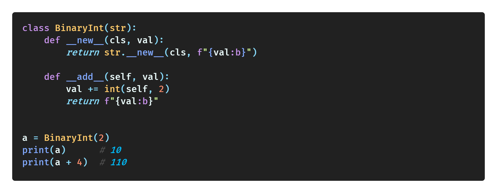
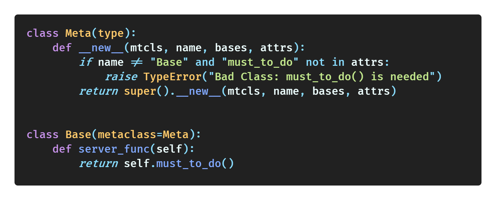
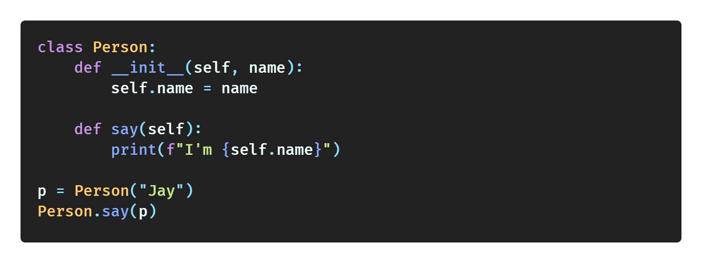
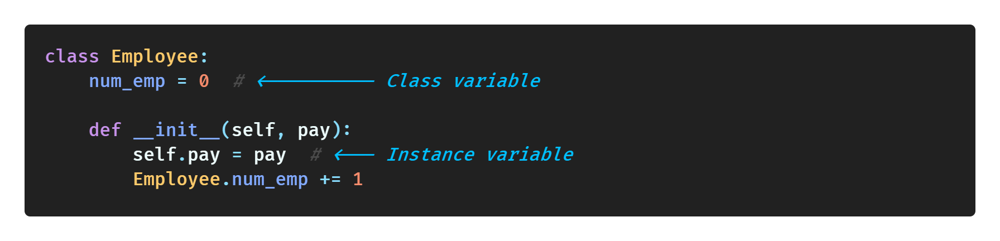
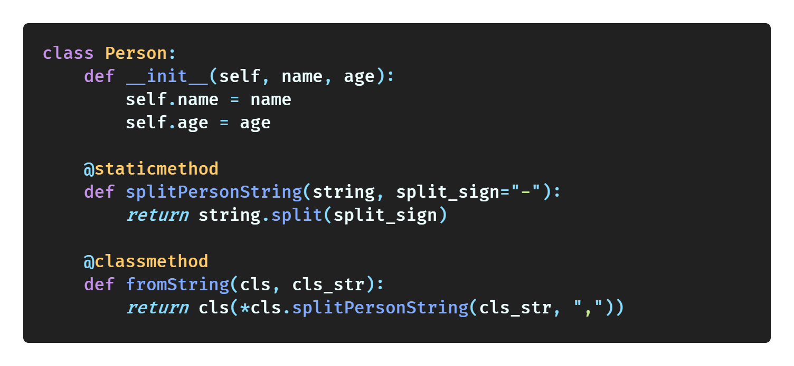

# PythonTricks42

42 for the universe, which means I want to use the opportunity of creating this repository to learn all the skills of python!

All the tricks in the repo are built on the idea that you have a deep understanding of the basic operations of Python, such as string, condition, loop, list, dict, tuple, and so on. 

All tricks are based on the python 3 implementation.

## Table of contents

* [PythonTricks42](#pythontricks42)
  * [Table of contents](#table-of-contents)
  * [Must Know](#must-know)
  * [Classes](#classes)
  * [Function](#function)
  * [Collections](#collections)
  * [Itertools](#itertools)
  * [Conditions](#conditions)
  * [String](#string)
  * [Int](#int)
  * [List](#list)
  * [Set](#set)
  * [Tuple](#tuple)
  * [Dict](#dict)
  * [Try](#try)
  * [Design](#design)
  * [IPython](#ipython)
  * [Others](#others)

## Must Know

| Tricks                                                                        | Simple Demo                                                                                         |
| ----------------------------------------------------------------------------- | --------------------------------------------------------------------------------------------------- |
| [List & Dict & Set Comprehensions](must_know/list_dict_set_comprehensions.md) |  |
| [Lambda Functions](must_know/lambda_functions.md)                             |                          |
| [Map](must_know/map.md)                                                       |                                                    |
| [Filter](must_know/filter.md)                                                 |                                              |
| [Zip](must_know/zip.md)                                                       |                                                    |
| [Reduce](must_know/reduce.md)                                                 |                                              |
| [*args & **kwargs](must_know/arg_kwarg.md)                                    |                                    |
| [Generator (map, filter, zip)](must_know/generator.md)                        |                                        |
| [Closure & Decorator](must_know/closure_decorator.md)                         |                        |
| [Context Manager](must_know/context_manager.md)                               |                            |
| [Magic Method](must_know/magic_method.md)                                     |                                  |
| [Metaclasses](must_know/metaclasses.md)                                       |                                    |

## Classes

| Tricks                                                                    | Simple Demo                                                                                                                                      |
| ------------------------------------------------------------------------- | ------------------------------------------------------------------------------------------------------------------------------------------------ |
| [self (class instance)](classes/self_class_instance.md)                   |                                                                     |
| [variables (class & instance)](classes/variables_class_instance.md)       |                                                           |
| [method vs. classmethod vs. staticmethod](classes/method_class_static.md) |                                                                     |
| TODO: public private                                                      | https://www.youtube.com/watch?v=xY__sjI5yVU                                                                                                      |
| TODO: property, getter, setter, deleter                                   | https://www.youtube.com/watch?v=jCzT9XFZ5bw&list=PL-osiE80TeTsqhIuOqKhwlXsIBIdSeYtc&index=6                                                      |
| TODO: dataclasses                                                         | https://zhuanlan.zhihu.com/p/34963159, https://www.youtube.com/watch?v=FcVCfGJrkUQ,                                                              |
| TODO: LEGB                                                                | https://www.youtube.com/watch?v=QVdf0LgmICw                                                                                                      |
| TODO: abstract class                                                      | https://medium.com/citycoddee/python%E9%80%B2%E9%9A%8E%E6%8A%80%E5%B7%A7-2-static-class-abstract-methods%E4%B9%8B%E5%AF%A6%E7%8F%BE-1e3b3998bccf |
| TODO: dynamic                                                             | https://youtu.be/sxTmJE4k0ho?t=17221                                                                                                             |

## Function

| Tricks                                   | Simple Demo                                                          |
| ---------------------------------------- | -------------------------------------------------------------------- |
| TODO: setattr, getattr                   | https://www.youtube.com/watch?v=C-gEQdGVXbk&list=LL&index=24&t=1148s |
| TODO: function in for                    | https://youtu.be/sxTmJE4k0ho?t=17462                                 |
| TODO: define and return conditional func | https://youtu.be/sxTmJE4k0ho?t=17704                                 |

## Collections

| Tricks            | Simple Demo                                  |
| ----------------- | -------------------------------------------- |
| TODO: defaultdict | https://youtu.be/SNTZpy0oDB8?list=LL&t=1319  |
| TODO: orderdict   | https://youtu.be/SNTZpy0oDB8?list=LL&t=1178  |
| TODO: counter     | https://youtu.be/SNTZpy0oDB8?list=LL&t=1609  |
| TODO: namedtuple  | https://youtu.be/sxTmJE4k0ho?list=LL&t=15915 |
| TODO: deque       | https://youtu.be/sxTmJE4k0ho?list=LL&t=16357 |

## Itertools

| Tricks | Simple Demo                                 |
| ------ | ------------------------------------------- |
| TODO:  | https://www.youtube.com/watch?v=Qu3dThVy6KQ |

## Conditions

| Tricks                     | Simple Demo                                                        |
| -------------------------- | ------------------------------------------------------------------ |
| TODO: Ternary Conditionals | https://www.youtube.com/watch?v=C-gEQdGVXbk&list=LL&index=24&t=34s |

## String

| Tricks        | Simple Demo                                                                                                                              |
| ------------- | ---------------------------------------------------------------------------------------------------------------------------------------- |
| TODO: fstring | https://blog.louie.lu/2017/08/08/outdate-python-string-format-and-fstring/, https://www.youtube.com/watch?v=nghuHvKLhJA&list=LL&index=19 |
| TODO: getpass | https://www.youtube.com/watch?v=C-gEQdGVXbk&list=LL&index=24&t=1584s                                                                     |

## Int

| Tricks                        | Simple Demo                                                         |
| ----------------------------- | ------------------------------------------------------------------- |
| TODO: Underscore Placeholders | https://www.youtube.com/watch?v=C-gEQdGVXbk&list=LL&index=24&t=133s |

## List

| Tricks           | Simple Demo                                                                                                     |
| ---------------- | --------------------------------------------------------------------------------------------------------------- |
| TODO: enumerate  | https://www.youtube.com/watch?v=C-gEQdGVXbk&list=LL&index=24&t=410s, https://youtu.be/VBokjWj_cEA?list=LL&t=189 |
| TODO: for...else | https://youtu.be/VBokjWj_cEA?list=LL&t=867                                                                      |

## Set

| Tricks                  | Simple Demo                                                                                                    |
| ----------------------- | -------------------------------------------------------------------------------------------------------------- |
| TODO: set for searching | https://stackoverflow.com/questions/2831212/python-sets-vs-lists/17945009, https://youtu.be/r3R3h5ly_8g?t=1010 |

## Tuple

| Tricks                                                       | Simple Demo                                |
| ------------------------------------------------------------ | ------------------------------------------ |
| TODO: unpacking https://youtu.be/C-gEQdGVXbk?list=LL&t=1033, | https://youtu.be/SNTZpy0oDB8?list=LL&t=795 |
| TODO: swap                                                   | https://youtu.be/VBokjWj_cEA?list=LL&t=445 |
| TODO: assign *variable                                       |                                            |

## Dict

| Tricks    | Simple Demo                                |
| --------- | ------------------------------------------ |
| TODO: get | https://youtu.be/VBokjWj_cEA?list=LL&t=726 |

## Try

| Tricks     | Simple Demo                                 |
| ---------- | ------------------------------------------- |
| TODO: TEEF | https://youtu.be/VBokjWj_cEA?list=LL&t=1331 |

## Design

| Tricks            | Simple Demo |
| ----------------- | ----------- |
| TODO: annotation  |             |
| TODO: typing,     |             |
| TODO: (...), pass |             |

## IPython

| Tricks                   | Simple Demo |
| ------------------------ | ----------- |
| TODO: vscode python file |             |
| TODO: timeit, time       |             |
| TODO: memit              |             |

## Others

| Tricks               | Simple Demo |
| -------------------- | ----------- |
| TODO: numba          |             |
| TODO: numpy          |             |
| TODO: pandas         |             |
| TODO: matplotlib     |             |
| TODO: seaborn        |             |
| TODO: sklearn        |             |
| TODO: transformers   |             |
| TODO: beautiful soup |             |
| TODO: requests       |             |
| TODO: scrapy         |             |
| TODO: selenium       |             |
