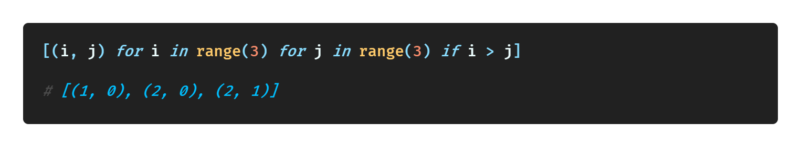
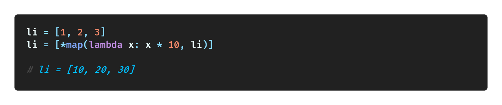
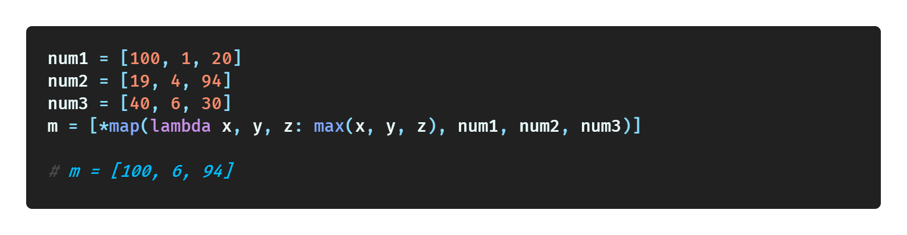
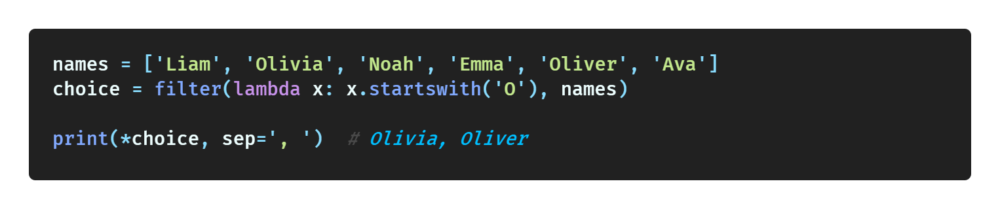
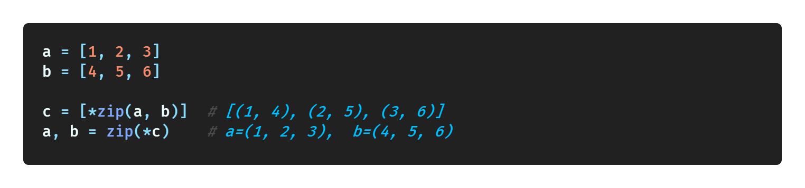
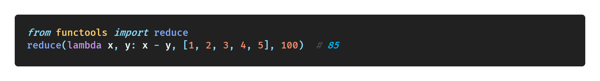
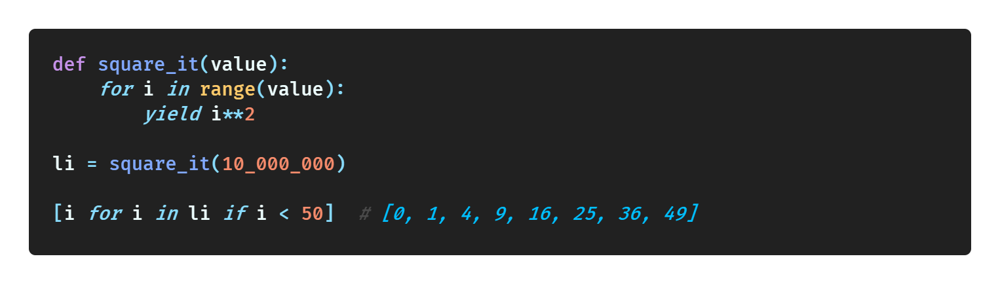
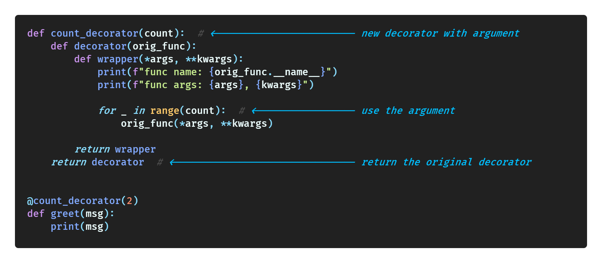
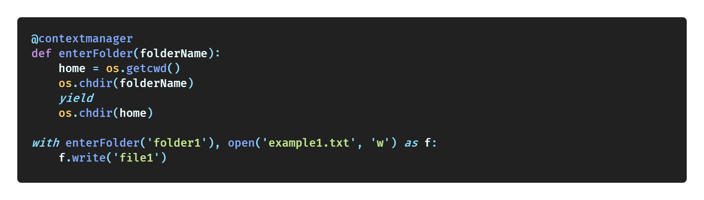

# PythonTricks42

42 for the universe, which means I want to use the opportunity of creating this repository to learn all the skills of python!

All the tricks in the repo are built on the idea that you have a deep understanding of the basic operations of Python, such as string, condition, loop, list, dict, tuple, and so on. 

All tricks are based on the python 3 implementation.

## Table of contents

* [PythonTricks42](#pythontricks42)
  * [Table of contents](#table-of-contents)
  * [Must Know](#must-know)
  * [String](#string)
  * [Int](#int)
  * [List](#list)
  * [Set](#set)
  * [Tuple](#tuple)
  * [Design](#design)
  * [Classes](#classes)
  * [IPython](#ipython)
  * [Others](#others)

## Must Know

| Tricks                                                                        | Simple Demo                                                                                         |
| ----------------------------------------------------------------------------- | --------------------------------------------------------------------------------------------------- |
| [List & Dict & Set Comprehensions](must_know/list_dict_set_comprehensions.md) |  |
| [Lambda Functions](must_know/lambda_functions.md)                             |                          |
| [Map](must_know/map.md)                                                       |                                                    |
| [Filter](must_know/filter.md)                                                 |                                              |
| [Zip](must_know/zip.md)                                                       |                                                    |
| [Reduce](must_know/reduce.md)                                                 |                                              |
| [*args & **kwargs](must_know/arg_kwarg.md)                                    |                                    |
| [Generator (map, filter, zip)](must_know/generator.md)                        |                                        |
| [Closure & Decorator](must_know/closure_decorator.md)                         |                        |
| [Context Manager](must_know/context_manager.md)                               |                            |

## String

fstring

## Int

add _

## List

for...else

## Set

set for searching

## Tuple

swap

## Design

annotation, typing, (...), pass

## Classes

OOP
static, class, nonlocal, global, abstract methods
private, property, dataclasses

## IPython

vscode python file, timeit, time

## Others

numba

