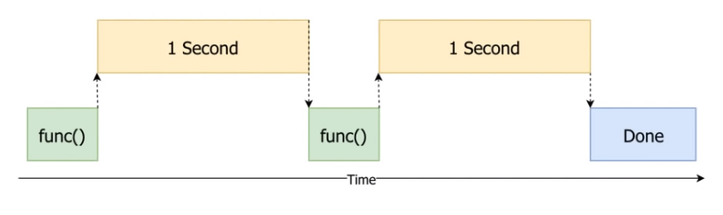
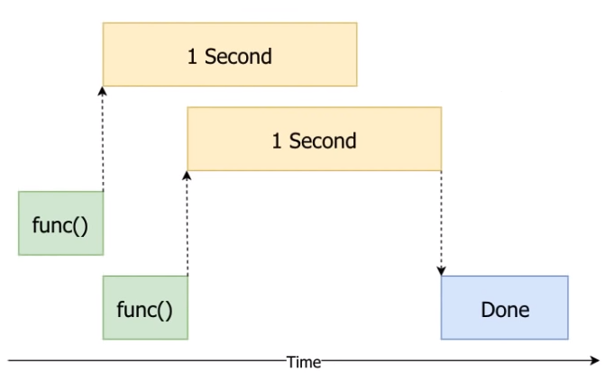
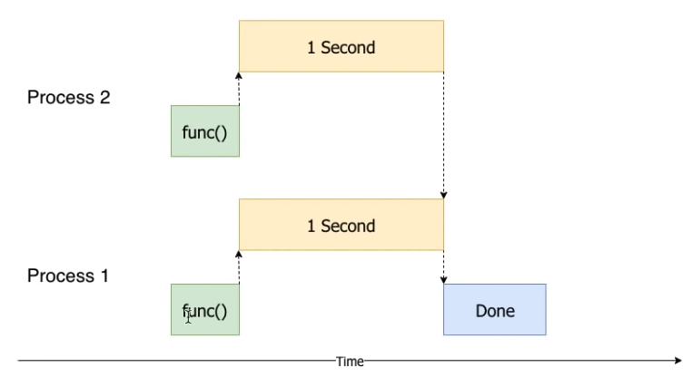

# Threading & Multiprocessing

This post draws on [Corey Schafer](https://www.youtube.com/channel/UCCezIgC97PvUuR4_gbFUs5g)'s video, using the images from it, and is especially appreciated here.

## Table of Contents

* [Threading & Multiprocessing](#threading--multiprocessing)
  * [Table of Contents](#table-of-contents)
  * [Difference](#difference)
  * [Basic](#basic)
    * [Threading](#threading)
    * [Multiprocessing](#multiprocessing)
  * [Concurrent.futures](#concurrentfutures)
    * [Concurrent.futures.ThreadPoolExecutor](#concurrentfuturesthreadpoolexecutor)
    * [Concurrent.futures.ProcessPoolExecutor](#concurrentfuturesprocesspoolexecutor)
* [Related Articles](#related-articles)

## Difference

If we run two functions that take one second as usual, the process will look like the figure below.



We can draw the difference between `multithreading` and `multiprocessing` in the table below. Threading, as the name implies, creates **threads** to process in parallel, and processing creates **processes** to process in parallel as well.

| Multithreading                         | Multiprocessing                              |
| -------------------------------------- | -------------------------------------------- |
|  |  |

A little more detail on the differences:

| Multithreading                                                             | Multiprocessing                            |
| -------------------------------------------------------------------------- | ------------------------------------------ |
| Suitable for I/O bound tasks                                               | Suitable for CPU bound tasks               |
| Read, save, web scraping                                                   | For-loop calculations                      |
| Memory can be shared, but be careful with synchronization (race condition) | Memory cannot be shared between processes. |

## Basic

The documentation for both:

* [Threading](https://docs.python.org/3/library/threading.html#module-threading)
* [Multiprocessing](https://docs.python.org/3/library/multiprocessing.html)

The basics are almost identical. Just put the function into `Thread` (`Process`), then `start()` and finally `join()` and you're done.

### Threading

When using `threading`, since memory can be shared, we use the same `list` to store the results.

However, in this example, we run the functions for **3, 2, and 1 seconds** respectively, but end up putting them in the `list` in the order in which they **finish faster**.

``` py
import time
from threading import Thread


def func(secs):
    print(f"Start sleeping for {secs} secs")
    time.sleep(secs)
    results.append(f"End sleeping for {secs} secs")

start = time.time()
threads = []
results = []

for i in range(3, 0, -1):
    t = Thread(target=func, args=[i])
    t.start()
    threads.append(t)

for t in threads:
    t.join()

print(results)
print(f"Total Time: {time.time() - start:.2f}")


# Start sleeping for 3 secs
# Start sleeping for 2 secs
# Start sleeping for 1 secs
# ['End sleeping for 1 secs', 'End sleeping for 2 secs', 'End sleeping for 3 secs']

# Total Time: 3.01
```

### Multiprocessing

When you use `multiprocessing`, you have to use the `Queue` provided by `multiprocessing` to access the results because you can't share the memory. In addition, it must be run under `__main__` when used with **Windows systems**.

``` py
def func(secs, q):
    print(f"Start sleeping for {secs} secs")
    time.sleep(secs)
    q.put(f"End sleeping for {secs} secs")


if __name__ == "__main__":

    start = time.time()
    processes = []
    q = Queue()
    results = []

    for i in range(3, 0, -1):
        t = Process(target=func, args=[i, q])
        t.start()
        processes.append(t)

    for t in processes:
        results.append(q.get())
        t.join()

    print(results)
    print(f"Total Time: {time.time() - start:.2f}")


# Start sleeping for 3 secs
# Start sleeping for 2 secs
# Start sleeping for 1 secs
# ['End sleeping for 1 secs', 'End sleeping for 2 secs', 'End sleeping for 3 secs']

# Total Time: 3.12
```

## Concurrent.futures

Python has provided useful modules since [version 3.2: concurrent.futures](https://docs.python.org/3/library/concurrent.futures.html). In this module, it is possible to work more efficiently with the [context manager](context_manager.md) to achieve `threading` and `multiprocessing`. 

Under the generic interface `concurrent.futures.Executor`, `ThreadPoolExecutor` and `ProcessPoolExecutor` are implemented, respectively.

`Executor` implements both `submit()` and `map()` methods to handle functions that are to be threading and multiprocessing. 

1. `submit()` will return an object of type `Future`. The `Future` object can be used to retrieve the result by `Future.result()`, and can also be used to detect whether the future has been completed via `concurrent.futures.as_completed`.
2. `map()` directly returns the data that was run. In python 3.5, added `chunksize` parameter for `ProcessPoolExecutor` to improve the efficiency of multiprocessing.

### Concurrent.futures.ThreadPoolExecutor

The following is an example of a [ThreadPoolExecutor](https://docs.python.org/3/library/concurrent.futures.html#threadpoolexecutor-example) in python documentation. This example uses `threading` to retrieve the web page content of each URL in parallel. 

The example uses `executor.submit()` to get the `Future` object, then uses `concurrent.futures.as_completed` to confirm the completion of the object, and then uses `result()` to get the data.

``` py
import concurrent.futures
import urllib.request

URLS = [
    "http://www.foxnews.com/",
    "http://www.cnn.com/",
    "http://europe.wsj.com/",
    "http://www.bbc.co.uk/",
    "http://some-made-up-domain.com/",
]


def load_url(url, timeout):
    with urllib.request.urlopen(url, timeout=timeout) as conn:
        return conn.read()


with concurrent.futures.ThreadPoolExecutor(max_workers=5) as executor:
    futures = {executor.submit(load_url, url, 60): url for url in URLS}
    
    for future in concurrent.futures.as_completed(futures):
        url = futures[future]
        try:
            data = future.result()
        except Exception as e:
            print(f"{url} generated an exception: {e}")
        else:
            print(f"{url} page is {len(data)} bytes")


# http://europe.wsj.com/ generated an exception: HTTP Error 403: Forbidden
# http://www.foxnews.com/ page is 325699 bytes
# http://some-made-up-domain.com/ page is 64668 bytes
# http://www.cnn.com/ page is 1146623 bytes
# http://www.bbc.co.uk/ page is 313091 bytes
```

### Concurrent.futures.ProcessPoolExecutor

The [ProcessPoolExecutor](https://docs.python.org/3/library/concurrent.futures.html#processpoolexecutor-example) example, also from python documentation, parallels the task of validating prime numbers.

This example uses `map()` to directly display the returned values.

``` py
import math
import concurrent.futures

NUMBERS = [
    112272535095293,
    112582705942171,
    112272535095293,
    115280095190773,
    115797848077099,
    1099726899285419,
]

def isPrime(n):
    if n < 2:
        return False
    if n == 2:
        return True
    if n % 2 == 0:
        return False

    sqrt_n = int(math.floor(math.sqrt(n)))
    for i in range(3, sqrt_n + 1, 2):
        if n % i == 0:
            return False
    return True


if __name__ == "__main__":
    with concurrent.futures.ProcessPoolExecutor() as executor:
        for num, is_prime in zip(NUMBERS, executor.map(isPrime, NUMBERS, chunksize=4)):
            print(f"{num} is prime: {is_prime}")
```

# Related Articles

| Article                                                                                | Link                                                     |
| -------------------------------------------------------------------------------------- | -------------------------------------------------------- |
| Python Threading Tutorial: Run Code Concurrently Using the Threading Module            | https://www.youtube.com/watch?v=IEEhzQoKtQU              |
| Python Multiprocessing Tutorial: Run Code in Parallel Using the Multiprocessing Module | https://www.youtube.com/watch?v=fKl2JW_qrso              |
| Multi-processing 和Multi-threading 的優缺點                                            | https://www.maxlist.xyz/2020/03/15/python-threading/     |
| Python 好用模組教學 - concurrent.futures                                               | https://myapollo.com.tw/zh-tw/python-concurrent-futures/ |
